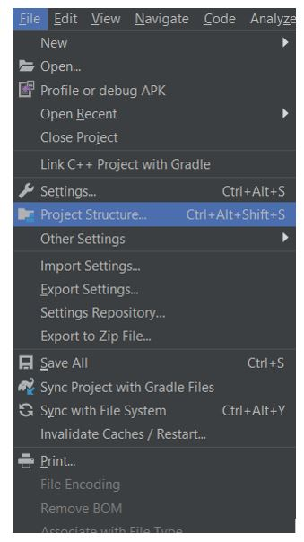
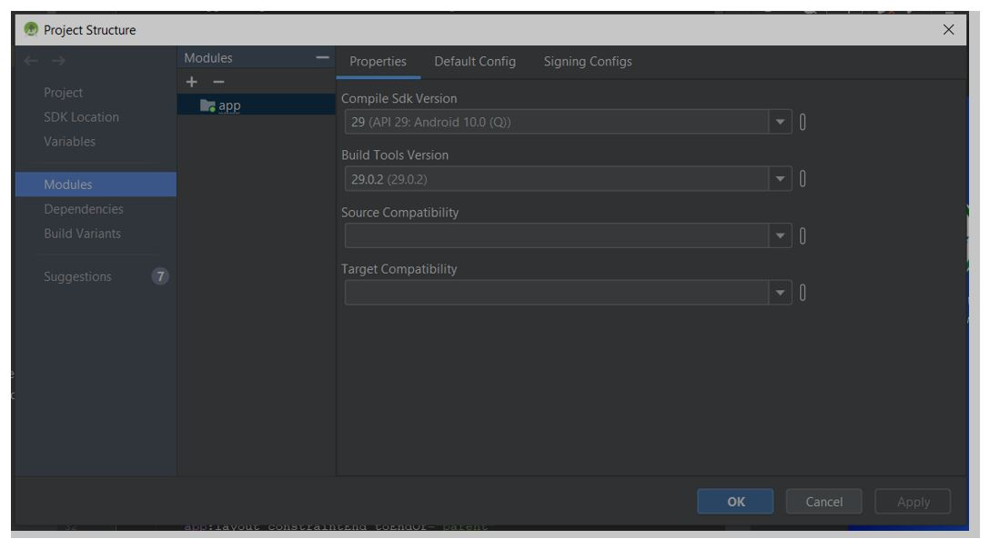
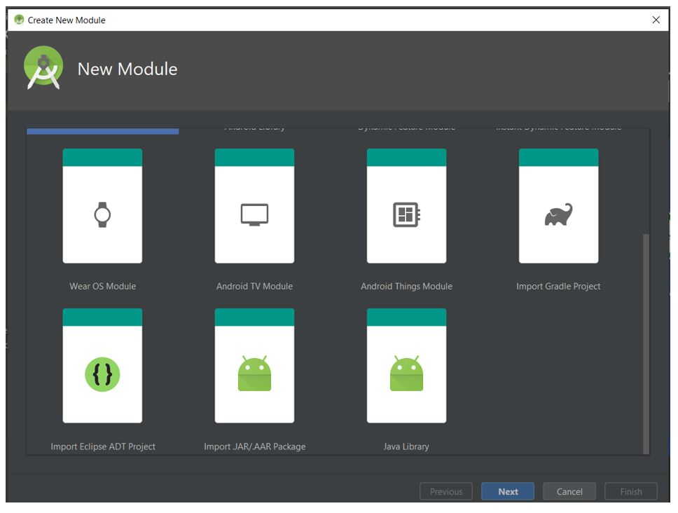
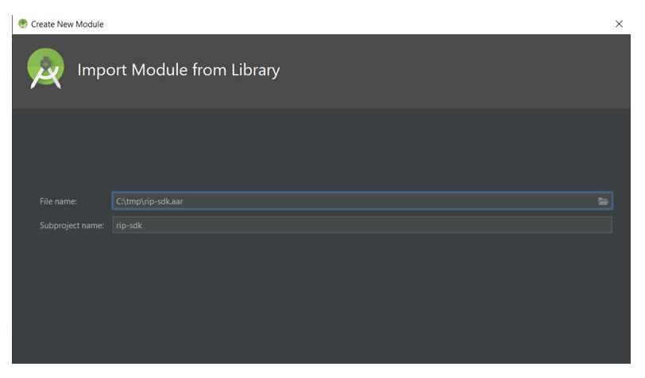
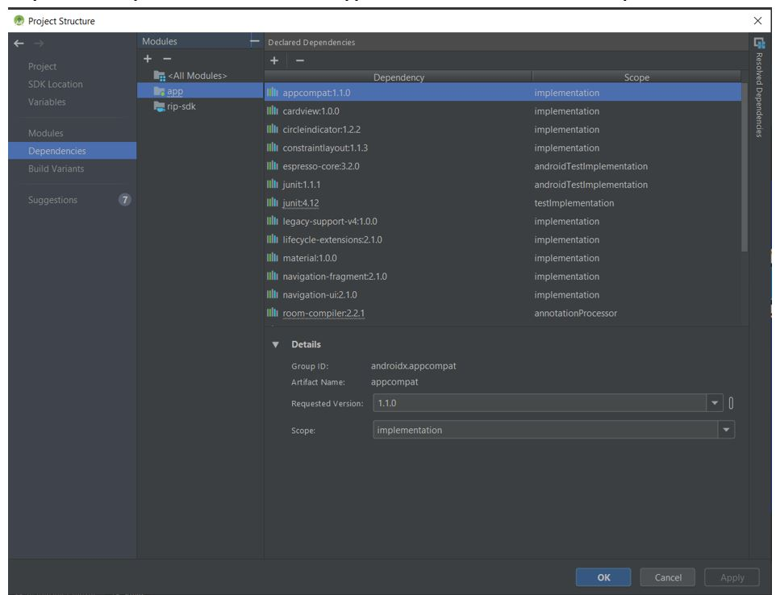
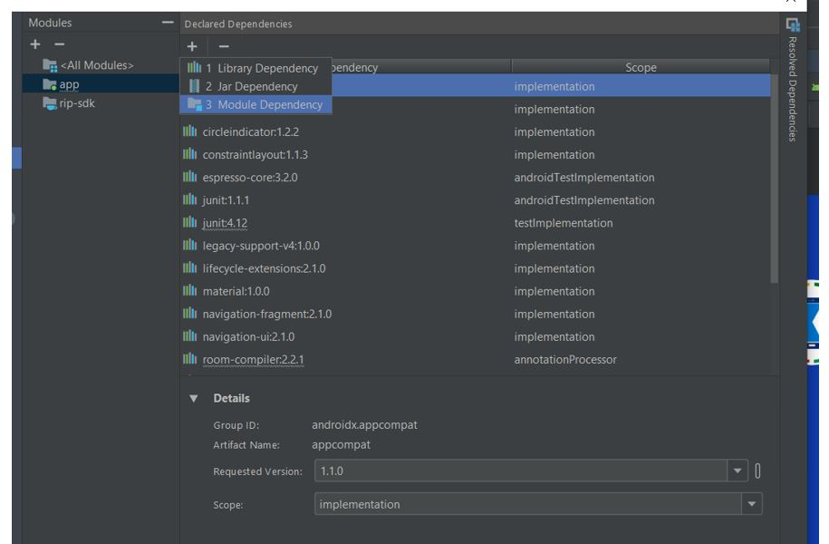
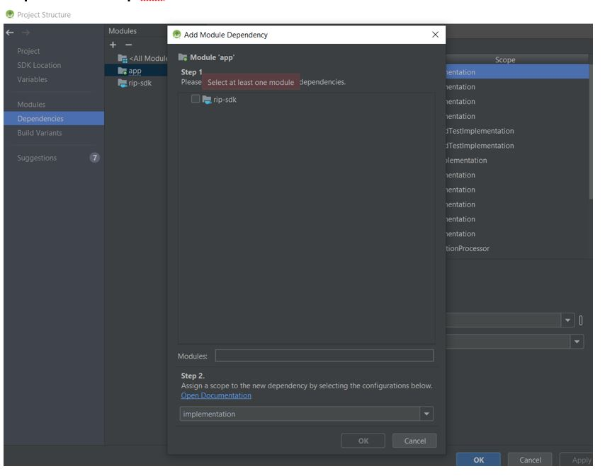
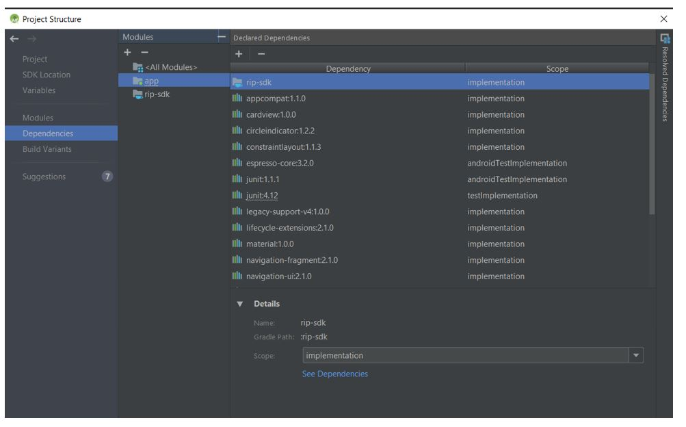
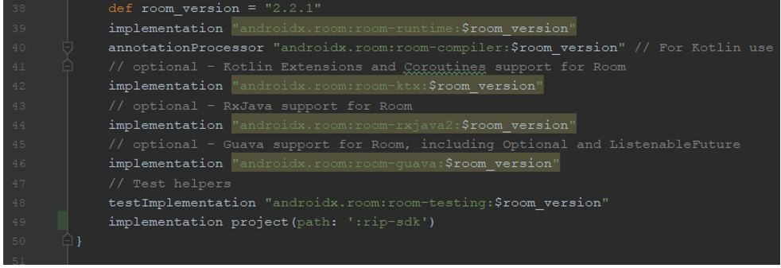
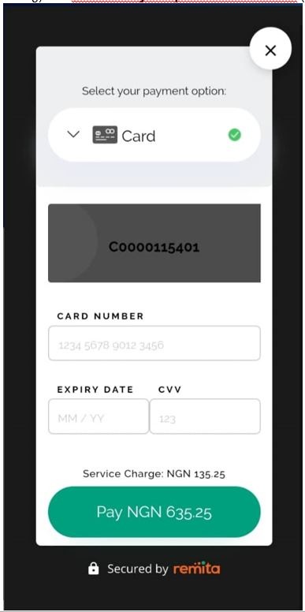

** **

# Remita Inline Payment SDK


## Table of Contents

**OVERVIEW**

**1.0  ANDROID SDK SETUP**

**2.0  TRY IT NOW**


## OVERVIEW

The following pages outlines the steps to integrating Remita Inline Payment SDK to your app.

## 1.0         Note: This setup is done on Android Studio 3.5

**Step 1:** Go to **File** in Menu bar

**Step 2:** Click on **Project Structure**


 

**Step 3:** Select **Modules** and click the &quot; **+**&quot; under Modules section to add the &quot;rip-sdk.aar&quot; to your project.
Note: You can find the rip-sdk.aar at: https://github.com/RemitaNet/remita-android/tree/master/aar

 


**Step 4:** Select Import .JAR/.AAR Package

 


**Step 5:** Locate rip-sdk.aar and click ok
 


**Step 6:** Select **Dependencies** and then select **app** then click on &quot; **+&quot;** under **Declared Dependencies**

 

**Step 7:** Select **Module Dependency**

 
**Step 8:** Select the **rip-sdk** module and click &#39;OK&#39;.

 
**Step 9:** Click on **Apply/Ok.**


**Step 10:** Rebuild project, you should see **implementation project(path: &#39;:rip-sdk&#39;)** in your dependencies block.


**Step 11:** Just in case
Add  **api 'com.google.code.gson:gson:2.8.2'** to your applications dependencies (If you haven't).
 
** **


# 2.0         TRY IT NOW

You should invoke the RemitaInlinePaymentSDK.getInstance() at any point when making payment:


**Sample Code:**
```java
public class MainActivity extends AppCompatActivity implements RemitaGatewayPaymentResponseListener {

    Button button;

    @Override
    protected void onCreate(Bundle savedInstanceState) {
        super.onCreate(savedInstanceState);
        setContentView(R.layout.remita_activity_main);

        button = findViewById(R.id.button);
        button.setOnClickListener(new View.OnClickListener() {
            @Override
            public void onClick(View view) {

                EditText et_amount = findViewById(R.id.et_amount);
                String amount = et_amount.getText().toString();

                String url = RIPGateway.Endpoint.DEMO;
                String api_key = "QzAwMDAxOTUwNjl8NDMyNTkxNjl8ZTg0MjI2MDg4MjU0NzA2NTY2MTYwNGU1NjNiMjUzYjk4ZDQwZjljZGFiMTVmYTljMDUwMGQ0MDg2MjIyYjEyNTA1ZTE2MTMxNmE3ZjM1OTZmYmJkOTE2MTRiY2NmZTY5NTM4MGQ2MDBlZGJlZmM2ODc2YTc2M2M4MjgyZmFjODc=";
                String email = "diagboya@systemspecs.com.ng";
                String currencyCode = "NGN";
                String firstName = "Iyare";
                String lastName = "Diagboya";
                String customerId = "diagboya@systemspecs.com.ng";
                String phoneNumber = "07031731478";
                String transactionId = String.valueOf(new Date().getTime());
                String narration = "Bugatti Chiron 2020";

                RemitaInlinePaymentSDK remitaInlinePaymentSDK = RemitaInlinePaymentSDK.getInstance();
                remitaInlinePaymentSDK.setRemitaGatewayPaymentResponseListener(MainActivity.this);

                remitaInlinePaymentSDK.initiatePayment(MainActivity.this, url, api_key, email,
                        amount, currencyCode, firstName, lastName, customerId, phoneNumber, transactionId, narration);
            }
        });
    }

    @Override
    public void onPaymentCompleted(PaymentResponse paymentResponse) {

        Log.v("+++ Response: ", JsonUtil.toJson(paymentResponse));
        Toast.makeText(this, JsonUtil.toJson(paymentResponse), Toast.LENGTH_LONG);
    }
}
 ```


Where url can be:

**RIPGateway.Endpoint.DEMO** (for testing) and **RIPGateway.Endpoint.PRODUCTION** (for live).

